# API Troubleshooting Fundamentals

> **Substrate:** Salesforce REST API (GlanAir Home Solutions org)  
> **Tool:** Postman  
> **Auth method:** OAuth 2.0 (Authorization Code with PKCE)  
> **Purpose:** Demonstrate the ability to authenticate, query, create, update, and delete records via API — and diagnose common failure modes by reproducing them manually.

The auth pattern (OAuth 2.0), REST verbs, status-code semantics, rate-limit headers, and the error-diagnosis workflow shown here are the same primitives behind Stripe, Shopify, HubSpot, Twilio, Zendesk, and most B2B SaaS platforms. The substrate is Salesforce because I built the data model; the troubleshooting method is universal.

---

## 1. Authentication — OAuth 2.0 Handshake

Connected App configured in Salesforce with OAuth 2.0 scopes (`api`, `refresh_token`). Postman handles the Authorization Code flow with PKCE:

1. Postman redirects to Salesforce login
2. User authenticates and grants access
3. Salesforce returns an authorization code
4. Postman exchanges the code for an access token and refresh token

**Result:** Bearer token issued, attached automatically to all subsequent requests.

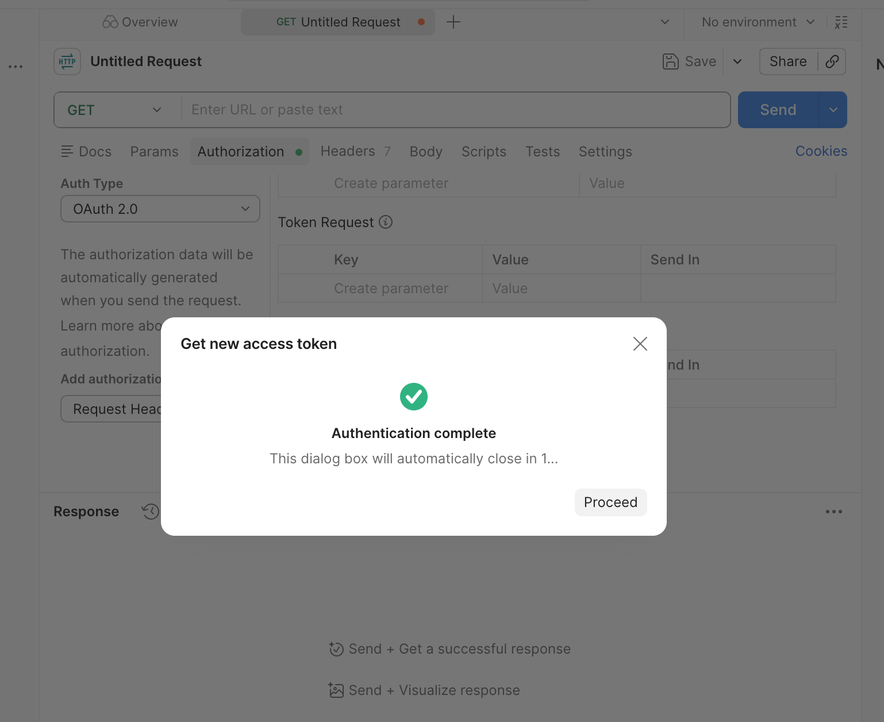

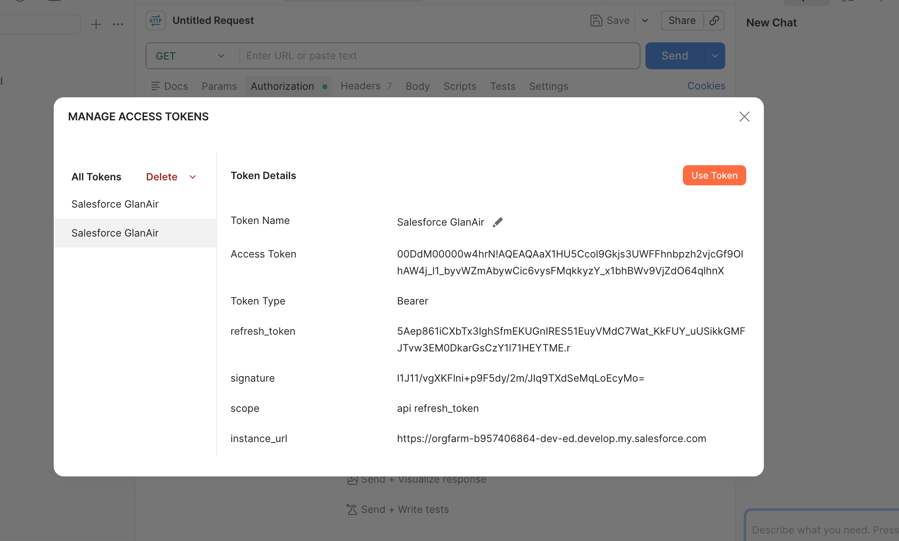

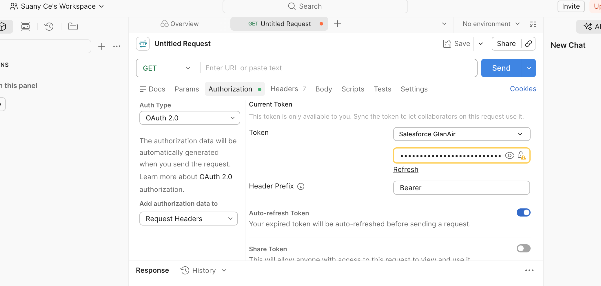

---

## 2. CRUD Operations — Reading and Writing GlanAir Data via API

### GET — Query Cases (SOQL)

```
GET /services/data/v62.0/query/?q=SELECT Id, Subject, Status FROM Case LIMIT 5
```

Returns live case records from the GlanAir org — the same cases documented in the main case study.

**Status:** `200 OK`

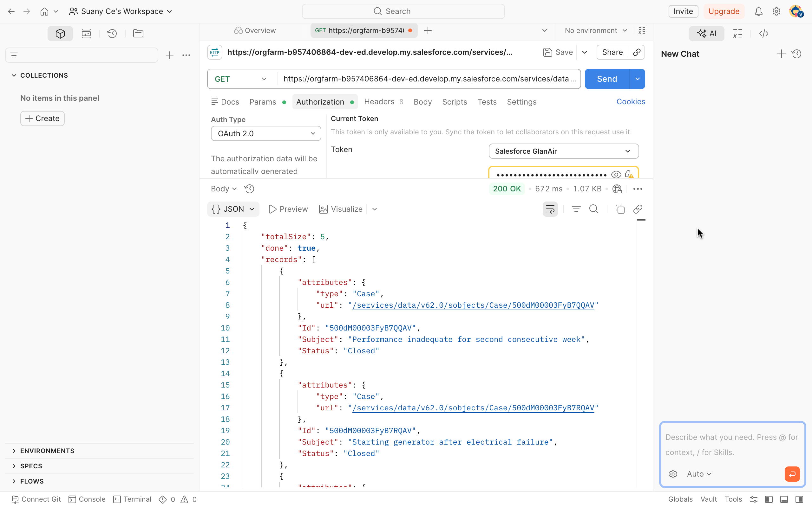

### GET — Query Contacts

```
GET /services/data/v62.0/query/?q=SELECT Id, Name, Email FROM Contact LIMIT 3
```

**Status:** `200 OK`

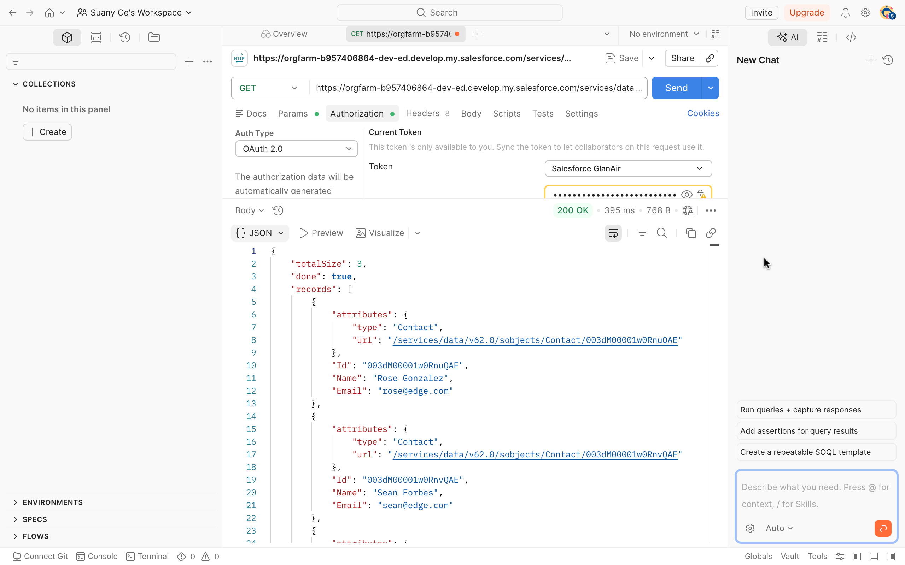

### POST — Create a Case

```
POST /services/data/v62.0/sobjects/Case
```

```json
{
  "Subject": "API Test - Customer reports dehumidifier not powering on",
  "Status": "New",
  "Origin": "Web",
  "Description": "Case created via Postman API to demonstrate POST request"
}
```

**Status:** `201 Created` — returns new record ID, `"success": true`, empty errors array.

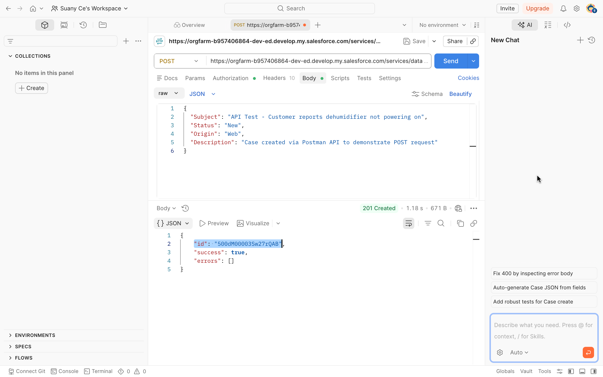

### PATCH — Update a Case

```
PATCH /services/data/v62.0/sobjects/Case/{id}
```

```json
{
  "Status": "Closed",
  "Description": "Resolved via API - unit was unplugged. Updated via PATCH request."
}
```

**Status:** `204 No Content` — success, no response body needed.

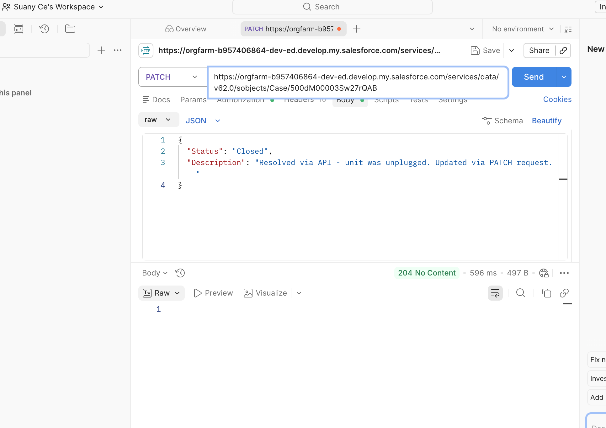

### DELETE — Remove a Case

```
DELETE /services/data/v62.0/sobjects/Case/{id}
```

**Status:** `204 No Content`

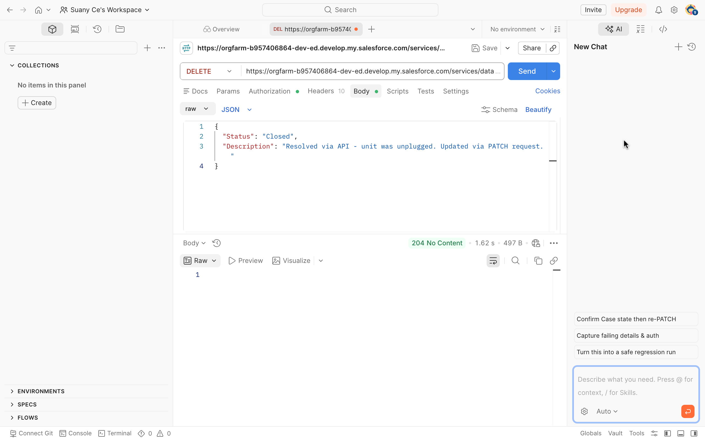

---

## 3. Error Diagnosis — Deliberately Breaking Requests

Anyone can send a request that works. Support engineers reproduce and diagnose requests that fail. Each error below was triggered intentionally to document the symptom, status code, root cause, and fix.

### 401 Unauthorized — Invalid or Expired Token

Replaced the Bearer token with a fake value to simulate an expired session.

**Symptom:** API returns `INVALID_SESSION_ID`  
**Root cause:** Token expired, was revoked, or was never valid  
**Fix:** Refresh the token or re-authenticate via OAuth  
**Support context:** When a customer says "the integration stopped working overnight," this is the first thing to check.

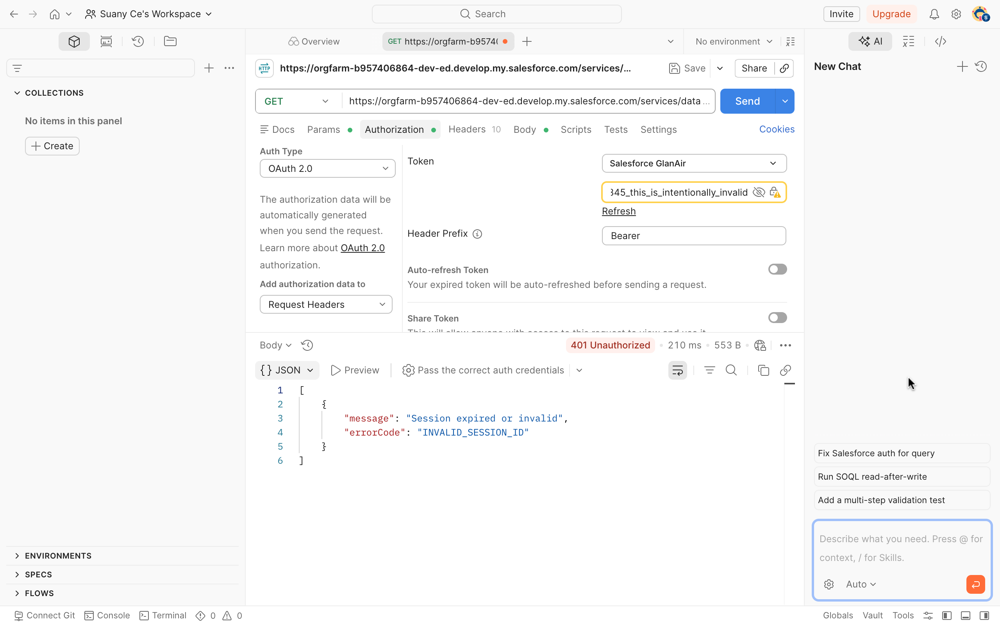

### 400 Bad Request — Invalid Field Name

Sent a POST with a misspelled field (`"Subjecttt"` instead of `"Subject"`).

**Symptom:** API returns `INVALID_FIELD` — no such column  
**Root cause:** Field name doesn't exist on the object (typo, changed schema, wrong API version)  
**Fix:** Check field API names in Setup → Object Manager → Case → Fields & Relationships  
**Support context:** Common when a customer's integration was configured against an old field that was renamed or deleted, or when a CSV import has mismatched column headers.

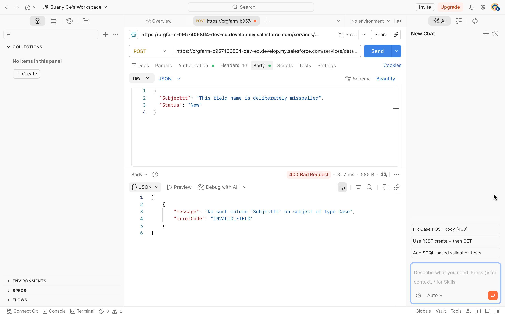

### 404 Not Found — Non-Existent Record

Sent a GET request with a fabricated record ID.

**Symptom:** API returns `NOT_FOUND`  
**Root cause:** Record doesn't exist — it was deleted, merged, or the ID is from a different org/environment  
**Fix:** Verify the record ID, confirm the correct org, check if the record was recently deleted (Recycle Bin)  
**Support context:** Happens when a customer copies a record link from sandbox into production, or references a merged/deleted record in an integration.


---

## 4. Observability — Rate Limit Monitoring

On any successful response, the `Sforce-Limit-Info` response header shows current API usage:

```
Sforce-Limit-Info: api-usage=15/15000
```

This tells you how many of the org's daily API calls have been consumed. In production, when a customer reports "our integration suddenly stopped pulling data," checking this header (or the API usage report in Setup) rules out quota exhaustion before you start debugging logic.

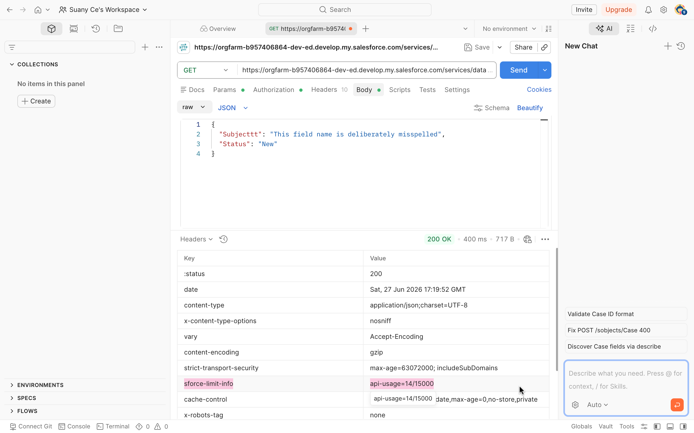

---

## Error Reference Table

| Scenario | Status Code | Error Key | Root Cause | Fix |
|---|---|---|---|---|
| Expired or fake token | `401` | `INVALID_SESSION_ID` | Token expired or revoked | Refresh token or re-authenticate |
| Misspelled field name | `400` | `INVALID_FIELD` | Field doesn't exist on object | Check field API names in Object Manager |
| Non-existent record ID | `404` | `NOT_FOUND` | Record deleted, merged, or wrong org | Verify ID and environment |
| API quota exhausted | `429` | (rate limit exceeded) | Daily API call limit hit | Monitor `Sforce-Limit-Info` header proactively |

---

*This section is part of the [GlanAir Operations Case Study](../README.md).*
